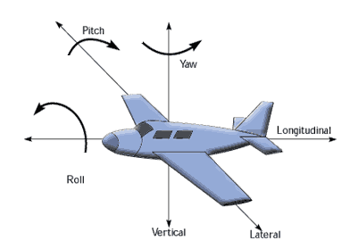

# **Dynamic Bicycle Model with Cornering Stiffness**

## Iteration

I think we should start by modeling the bycicle first, then add some other variables like u did (air stuff)

---
### Just to make it clear 

- **Yaw**: Rotation about the vertical axis (z-axis). In the context of the bicycle model, yaw is important for determining the turning of the vehicle.
- **Pitch**: Rotation about the lateral axis (y-axis). This is generally associated with the up and down movement of the bicycle, such as during acceleration or deceleration.
- **Roll**: Rotation about the longitudinal axis (x-axis). Roll can be influenced by forces such as banking in turns.

## State Variables

The bicycle model is described by the following state variables:

- $v_x$: Longitudinal velocity (m/s) — the speed of the bicycle in the direction of travel.
- $v_y$: Lateral velocity (m/s) — the speed of the bicycle perpendicular to the direction of travel (side-slip motion).
- $\omega$: Yaw rate (rad/s) — the rate at which the bicycle rotates about its vertical axis (turning).

The state vector is defined as:

$$
\mathbf{x} = \begin{bmatrix} v_x \\ v_y \\ \omega \end{bmatrix}
$$

## Control Inputs

The control inputs for the bicycle model are:

- $F_x$: Longitudinal force (N) — force applied to the rear wheels (e.g., due to engine power or braking).
- $\delta$: Steering angle (rad) — the angle of the front wheels with respect to the longitudinal axis.

The input vector is defined as:

$$
\mathbf{u} = \begin{bmatrix} F_x \\ \delta \end{bmatrix}
$$

## Lateral Tire Forces

The lateral forces on the front and rear tires are proportional to the **cornering stiffness** and the **slip angles** of the tires. These forces are modeled using the following equations (assuming this is linear (is not but just to make it easy :v)):

- Front tire lateral force: $F_{yf} = -C_f \alpha_f$
- Rear tire lateral force: $F_{yr} = -C_r \alpha_r$

Where:
- $C_f$: Cornering stiffness of the front tires (N/rad).
- $C_r$: Cornering stiffness of the rear tires (N/rad).
- $\alpha_f$: Slip angle of the front tire (rad).
- $\alpha_r$: Slip angle of the rear tire (rad).

### Slip Angles

The slip angles are determined by the relative motion between the tires and the road. They are computed as:

- Front tire slip angle:
  $$
  \alpha_f = \delta - \tan^{-1}\left(\frac{v_y + L_f \omega}{v_x}\right)
  $$

- Rear tire slip angle:
  $$
  \alpha_r = -\tan^{-1}\left(\frac{v_y - L_r \omega}{v_x}\right)
  $$

Where:
- $L_f$: Distance from the center of mass (CoM) to the front axle (m).
- $L_r$: Distance from the center of mass (CoM) to the rear axle (m).

## Dynamic Equations

The dynamic equations describe the longitudinal, lateral, and yaw motions of the bicycle:

### 1. Longitudinal Dynamics

The equation for the longitudinal motion is:

$$
m (\dot{v}_x - v_y \omega) = F_x + C_f (\delta - \alpha_f) \sin(\delta)
$$

Where:
- $m$: Mass of the bicycle (kg).
- $F_x$: Longitudinal force (N).

### 2. Lateral Dynamics

The equation for the lateral motion is:

$$
m (\dot{v}_y + v_x \omega) = -C_f (\delta - \alpha_f) \cos(\delta) - C_r \alpha_r
$$

Where:
- $C_f$: Cornering stiffness of the front tires (N/rad).
- $C_r$: Cornering stiffness of the rear tires (N/rad).

### 3. Yaw Dynamics

The equation for the yaw motion is:

$$
I_z \dot{\omega} = L_f \big[-C_f (\delta - \alpha_f)\big] \cos(\delta) - L_r \big[-C_r \alpha_r\big]
$$

Where:
- $I_z$: Moment of inertia of the bicycle about the vertical axis (kg·m²).
- $L_f$: Distance from the center of mass to the front axle (m).
- $L_r$: Distance from the center of mass to the rear axle (m).

## State-Space Representation

The dynamic bicycle model can be written in **state-space form** for control design and simulation:

$$
\dot{\mathbf{x}} = \mathbf{A} \mathbf{x} + \mathbf{B} \mathbf{u}
$$

Where:
- $\mathbf{x} = \begin{bmatrix} v_x \\ v_y \\ \omega \end{bmatrix}$ is the state vector.
- $\mathbf{u} = \begin{bmatrix} F_x \\ \delta \end{bmatrix}$ is the input vector.

### Matrices

The state-space matrices $\mathbf{A}$ and $\mathbf{B}$ can be derived by linearizing the nonlinear dynamic equations. They take the following form:

#### Matrix $\mathbf{A}$:

$$
\mathbf{A} = \begin{bmatrix}
0 & 0 & -v_y \\
0 & \frac{-2(C_f + C_r)}{m v_x} & \frac{-v_x - 2(L_f C_f - L_r C_r)}{m v_x} \\
0 & \frac{-2(L_f C_f - L_r C_r)}{I_z v_x} & \frac{-2(L_f^2 C_f + L_r^2 C_r)}{I_z v_x}
\end{bmatrix}
$$

#### Matrix $\mathbf{B}$:

$$
\mathbf{B} = \begin{bmatrix}
\frac{1}{m} & 0 \\
0 & \frac{2 C_f}{m} \\
0 & \frac{2 L_f C_f}{I_z}
\end{bmatrix}
$$

---

# Bicycle Model with Inertial Frame

This section explains the dynamics of the bicycle model as observed from an **inertial frame**. The inertial frame is a reference frame that is fixed in space, typically represented as a stationary coordinate system, and is essential for describing the motion of the bicycle.

## Bicycle Motion in the Inertial Frame

The bicycle's motion is described in relation to a fixed **inertial frame**. The coordinates of the bicycle in the inertial frame are denoted as follows:

- **$x_{\text{inertial}}$**: Longitudinal position in the inertial frame (m)
- **$y_{\text{inertial}}$**: Lateral position in the inertial frame (m)
- **$\theta_{\text{inertial}}$**: Orientation (yaw angle) of the bicycle relative to the inertial frame (rad)

The bicycle moves in the 2D plane, and its dynamics are governed by its **position**, **velocity**, and **orientation**. The inertial frame is fixed, so the bicycle's position is measured relative to this fixed coordinate system.

### Kinematic Equations in the Inertial Frame

In the inertial frame, the bicycle's state can be described as follows:

1. **Position (Longitudinal and Lateral):**

   The position of the bicycle in the inertial frame evolves as a function of the velocity components:

   $$ \dot{x}_{\text{inertial}} = v_x \cos(\theta_{\text{inertial}}) - v_y \sin(\theta_{\text{inertial}}) $$

   $$ \dot{y}_{\text{inertial}} = v_x \sin(\theta_{\text{inertial}}) + v_y \cos(\theta_{\text{inertial}}) $$

   Where:
   - **$v_x$**: Longitudinal velocity in the bicycle's frame (m/s)
   - **$v_y$**: Lateral velocity in the bicycle's frame (m/s)

2. **Orientation (Yaw):**

   The orientation (yaw angle) of the bicycle relative to the inertial frame changes over time due to the **yaw rate**:

   $$ \dot{\theta}_{\text{inertial}} = \omega $$

   Where **$\omega$** is the yaw rate (rad/s).

### Bicycle Dynamics in the Inertial Frame

The state of the bicycle at any time can be represented by the state vector:

$$
\mathbf{x} = \begin{bmatrix} x_{\text{inertial}} \\ y_{\text{inertial}} \\ \theta_{\text{inertial}} \\ v_x \\ v_y \\ \omega \end{bmatrix}
$$

The evolution of the state is described by the following system of equations in the inertial frame:

$$
\dot{\mathbf{x}} = \begin{bmatrix} \dot{x}_{\text{inertial}} \\ \dot{y}_{\text{inertial}} \\ \dot{\theta}_{\text{inertial}} \\ \dot{v}_x \\ \dot{v}_y \\ \dot{\omega} \end{bmatrix}
= \mathbf{A} \mathbf{x} + \mathbf{B} \mathbf{u}
$$

Where:
- **$\mathbf{A}$**: The system matrix, which captures the relationships between the states and their time derivatives.
- **$\mathbf{B}$**: The input matrix, which defines the effect of control inputs (e.g., longitudinal force and steering angle) on the system.

### Control Inputs

The system's dynamics are influenced by the control inputs:
- **$F_x$**: Longitudinal force applied to the rear wheels (N)
- **$\delta$**: Steering angle (rad)

These inputs affect the longitudinal and lateral velocities, as well as the yaw rate, through the state-space equations.

## State-Space Representation

The state-space equation is given by:

$$
\dot{\mathbf{x}} = \begin{bmatrix}
\dot{x}_{\text{inertial}} \\
\dot{y}_{\text{inertial}} \\
\dot{\theta}_{\text{inertial}} \\
\dot{v}_x \\
\dot{v}_y \\
\dot{\omega}
\end{bmatrix}
= \begin{bmatrix}
\text{Equation for } \dot{x}_{\text{inertial}} \\
\text{Equation for } \dot{y}_{\text{inertial}} \\
\text{Equation for } \dot{\theta}_{\text{inertial}} \\
\text{Equation for } \dot{v}_x \\
\text{Equation for } \dot{v}_y \\
\text{Equation for } \dot{\omega}
\end{bmatrix}
$$

Where each component is described as follows:

### 1. Longitudinal Position ($x_{\text{inertial}}$)

The rate of change of the longitudinal position is given by:

$$
\dot{x}_{\text{inertial}} = v_x \cos(\theta_{\text{inertial}}) - v_y \sin(\theta_{\text{inertial}})
$$

### 2. Lateral Position ($y_{\text{inertial}}$)

The rate of change of the lateral position is:

$$
\dot{y}_{\text{inertial}} = v_x \sin(\theta_{\text{inertial}}) + v_y \cos(\theta_{\text{inertial}})
$$

### 3. Orientation (Yaw Angle, $\theta_{\text{inertial}}$)

The rate of change of the orientation (yaw angle) is:

$$
\dot{\theta}_{\text{inertial}} = \omega
$$

### 4. Longitudinal Velocity ($v_x$)

The rate of change of the longitudinal velocity is:

$$
\dot{v}_x = \frac{F_x}{m} - \omega v_y
$$

Where:
- $F_x$: Longitudinal force applied to the rear tires (N)
- $m$: Mass of the bicycle (kg)

### 5. Lateral Velocity ($v_y$)

The rate of change of the lateral velocity is:

$$
\dot{v}_y = \frac{1}{m} \left( C_f (\delta - \alpha_f) \cos(\delta) + C_r \alpha_r \right) - v_x \omega
$$

Where:
- $C_f$: Cornering stiffness of the front tires (N/rad)
- $C_r$: Cornering stiffness of the rear tires (N/rad)
- $\delta$: Steering angle (rad)
- $\alpha_f$: Slip angle of the front tires
- $\alpha_r$: Slip angle of the rear tires

### 6. Yaw Rate ($\omega$)

The rate of change of the yaw rate is:

$$
\dot{\omega} = \frac{1}{I_z} \left( L_f C_f (\delta - \alpha_f) \cos(\delta) - L_r C_r \alpha_r \right)
$$

Where:
- $I_z$: Moment of inertia about the vertical axis (kg·m²)
- $L_f$: Distance from the center of mass to the front axle (m)
- $L_r$: Distance from the center of mass to the rear axle (m)

## Objetiveishon of the dynamic model

Describe the evolution of the bicycle's state in the inertial frame of reference. The state vector $\mathbf{x}$ consists of the position, velocity, and orientation of the bicycle, and the state-space model governs how these variables change over time in response to the control inputs ($F_x$ and $\delta$).

---

# REFERENCIA PARA MODELO

https://www.youtube.com/watch?v=35lZlO6NrO0

https://hal.science/hal-04411274/document

https://www.youtube.com/watch?v=1k-sCL0SeRQ
